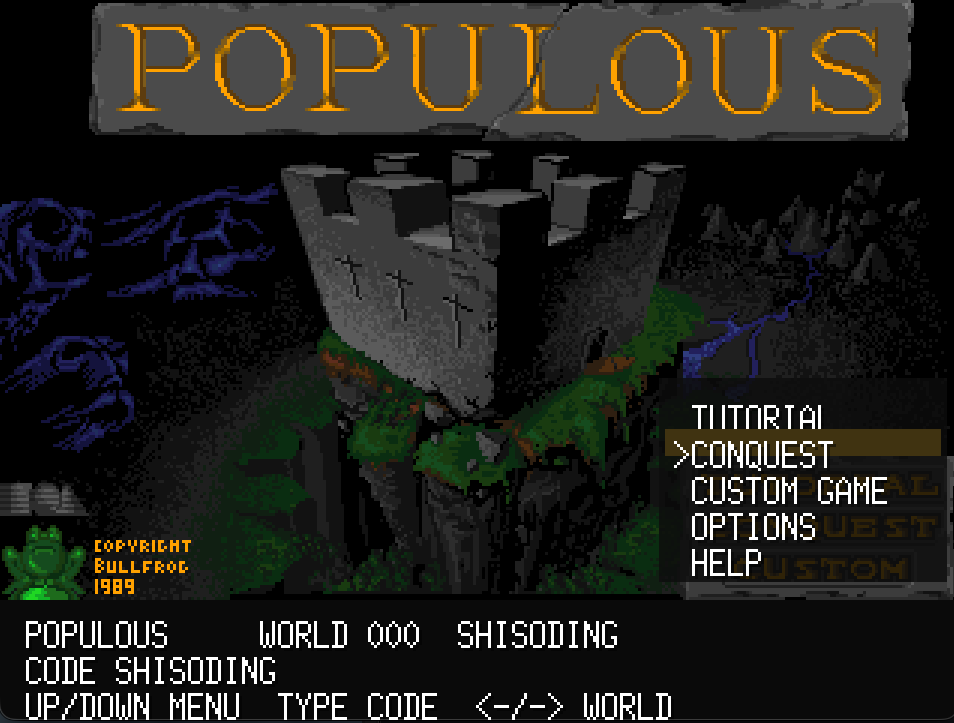
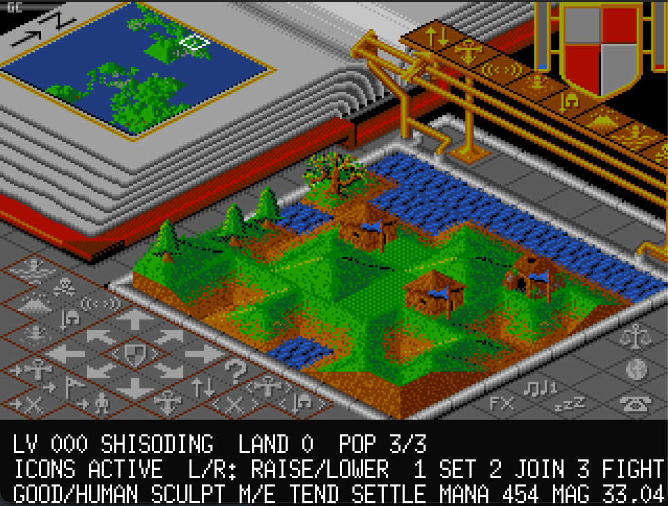
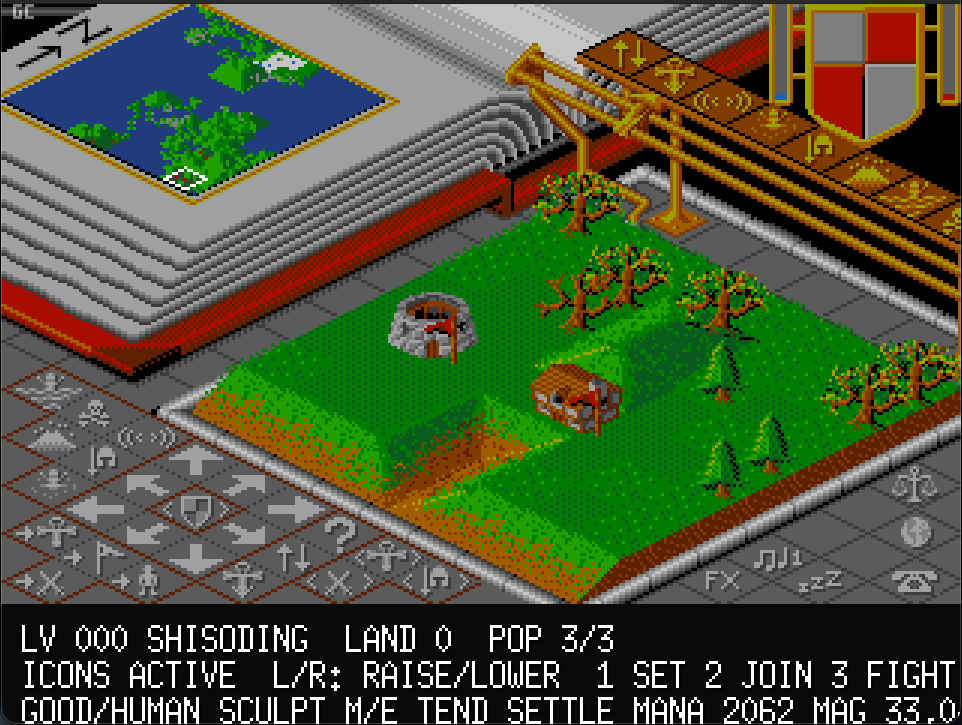
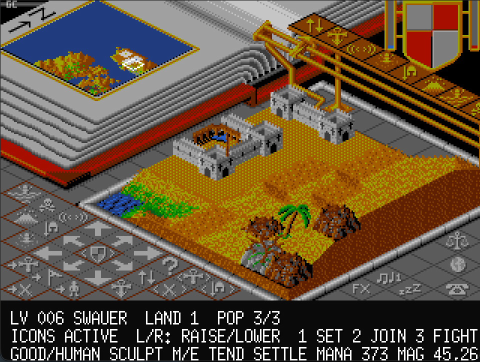

# Go Populous

A fan-made remake of Bullfrog's 1989 god-game classic [Populous](https://fr.wikipedia.org/wiki/Populous_%28jeu_vid%C3%A9o%29), written in Go with [Ebitengine](https://ebitengine.org/).

The project recreates the original isometric world view, terrain sculpting, population growth, opposing deity, mana-driven powers, conquest-style worlds, Amiga-inspired graphics, and sound playback from decoded game data.

## Media

### Gameplay Video

<video controls width="960" src="screenshots/Populous%20remake%20go.webm">
  <a href="screenshots/Populous%20remake%20go.webm">Watch the gameplay video</a>
</video>

[Watch the gameplay video](screenshots/Populous%20remake%20go.mp4)

### Screenshots

| | |
| --- | --- |
|  |  |
|  |  |

## Features

- Isometric 64x64 Populous-style world simulation.
- Terrain raising and lowering with mouse controls.
- Town growth, population movement, battles, followers, knights, ruins, swamps, water, and victory/loss conditions.
- Computer-controlled opponent, including land shaping and divine powers.
- Mana and population gauges, minimap, viewport navigation, and original-style icon controls.
- Tutorial, conquest, custom game options, save/load, restart, surrender, and PPC-vs-PPC simulation mode.
- Divine powers: earthquake, swamp, knight, volcano, flood, and armageddon.
- Multiple terrain sets decoded from Amiga data: grass, desert, snow/ice, and rocky worlds.
- Amiga-style graphics and audio decoding for screens, tiles, sprites, music, effects, and speech banks.

## Requirements

- Go 1.24 or newer.
- A platform supported by Ebitengine.
- Populous Amiga data files.

The loader searches for data in `assets/amiga` by default. You can also point it at another directory:

```sh
POPULOUS_AMIGA_DIR=/path/to/populous-amiga-data go run ./cmd/populous
```

Optional extracted screen PNGs can be provided with:

```sh
POPULOUS_EXTRACTED_IMAGE_DIR=/path/to/extracted-images go run ./cmd/populous
```

## Running

```sh
go run ./cmd/populous
```

The game opens a 960x720 window and renders internally at the original 320x240 logical resolution.

## Controls

- `Left click`: raise land under the cursor.
- `Right click`: lower land under the cursor.
- `W`, `A`, `S`, `D`: scroll the viewport.
- `Minimap click`: jump the viewport to that location.
- `Interface arrows`: scroll the viewport.
- `F`: toggle fullscreen.
- `H`: show help.
- `Esc`: open setup during play, or go back from menus.
- `Tab`: toggle atlas view.
- `M`: switch to papal magnet placement mode.
- `1`, `2`, `3`: set follower behavior to settle, join, or fight.
- `Left` / `Right`: move to the previous or next world.

The in-game icon panel also exposes movement, sound toggles, follower behavior, map centering, battle tracking, and divine powers.

## Project Layout

- `cmd/populous`: application entry point.
- `internal/game`: Ebitengine game loop, menus, rendering, input, save/load, and audio playback.
- `internal/populous`: world simulation, terrain generation, AI, powers, battles, snapshots, graphics decoding, and sound decoding.
- `internal/assets`: asset discovery and loading.
- `assets/amiga`: expected Amiga data-file location.
- `assets/extracted-images`: optional decoded screen image fallback.
- `screenshots`: screenshots and gameplay video used by this README.

## Development

Run the test suite with:

```sh
go test ./...
```

Build a local binary with:

```sh
go build ./cmd/populous
```

## Save Files

Save/load from the setup menu writes `go-populous.sav` in the current working directory.

## Legal Notice

This is an unofficial fan project and is not affiliated with Bullfrog Productions or Electronic Arts. Populous, related trademarks, and original game data belong to their respective rights holders.

The source code is distributed under the GPL-3.0 license. Original game assets, if used, are not covered by that license unless you have separate rights to distribute them.
