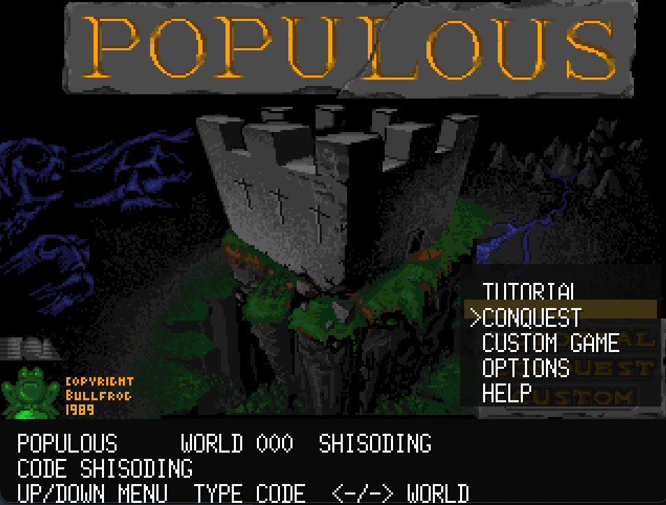
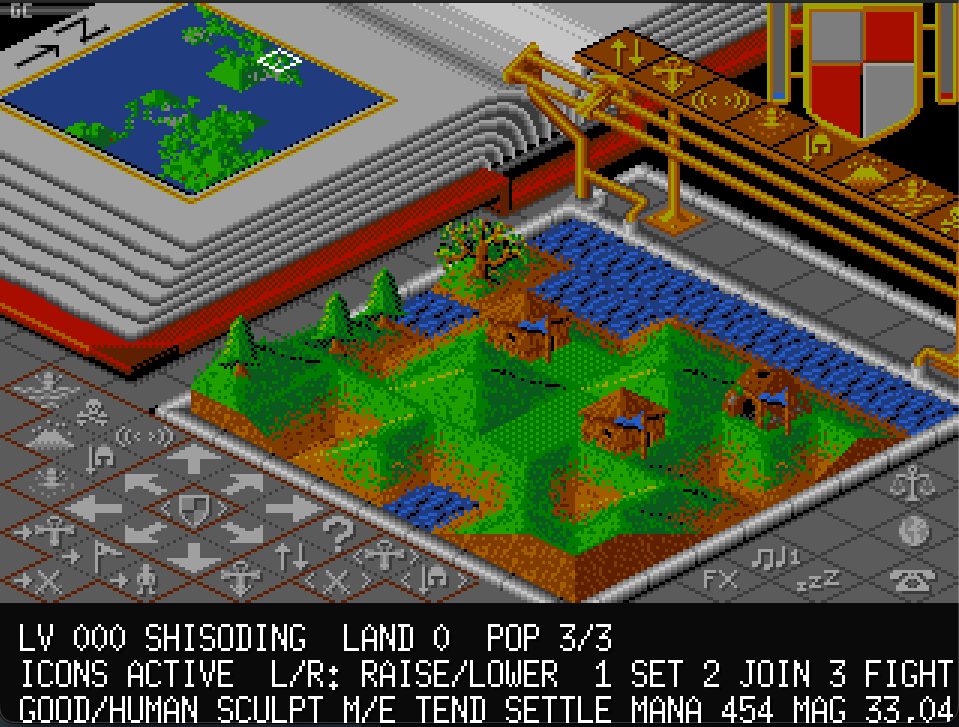
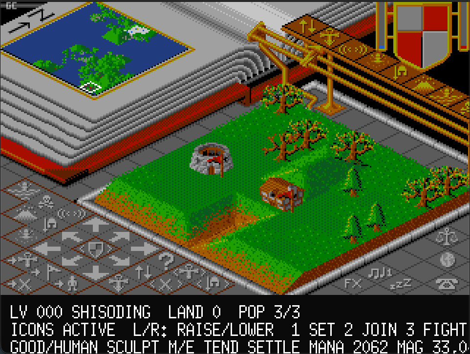
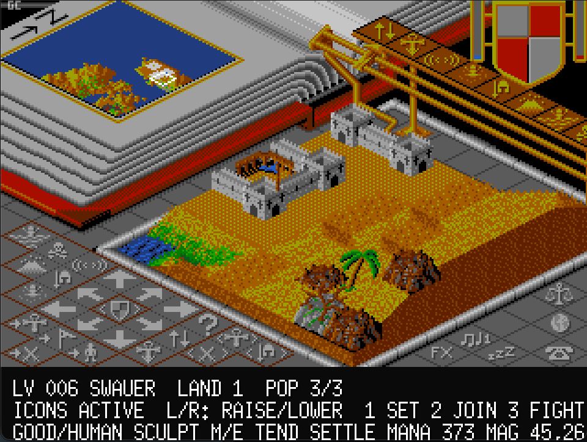

# Go Populous

A fan-made remake of Bullfrog's 1989 god-game classic [Populous](https://fr.wikipedia.org/wiki/Populous_%28jeu_vid%C3%A9o%29), written in Go with [Ebitengine](https://ebitengine.org/).

The project recreates the original isometric world view, terrain sculpting, population growth, opposing deity, mana-driven powers, conquest-style worlds, Amiga-inspired graphics, and sound playback from decoded game data.

## Media

### Gameplay Video

<video controls width="960" src="screenshots/Populous%20remake%20go.webm">
  <a href="screenshots/Populous%20remake%20go.webm">Watch the gameplay video</a>
</video>

[Watch the gameplay video](screenshots/Populous%20remake%20go.webm)

### Screenshots

| | |
| --- | --- |
|  |  |
|  |  |

## Features

- Isometric 64x64 Populous-style world simulation.
- Terrain raising and lowering with mouse controls.
- Town growth, population movement, battles, followers, knights, ruins, swamps, water, and victory/loss conditions.
- Computer-controlled opponent, including land shaping and divine powers.
- Automatic AI-vs-AI demonstration with two spectator cameras and a new strategic AI.
- Mana and population gauges, minimap, viewport navigation, and original-style icon controls.
- Tutorial, conquest, custom game options, save/load, restart, surrender, and PPC-vs-PPC simulation mode.
- Two-player TCP multiplayer with a versioned deterministic lockstep protocol, state hashes, and automatic snapshot resynchronization.
- Divine powers: earthquake, swamp, knight, volcano, flood, and armageddon.
- Multiple terrain sets decoded from Amiga data: grass, desert, snow/ice, and rocky worlds.
- Amiga-style graphics and audio decoding for screens, tiles, sprites, music, effects, and speech banks.

## Requirements

- Go 1.25 or newer.
- A platform supported by Ebitengine.
- Populous Amiga data files.

The loader searches for data in `assets/amiga` by default. You can also point it at another directory:

```sh
POPULOUS_AMIGA_DIR=/path/to/populous-amiga-data go run ./cmd/populous
```

Optional extracted screen PNGs can be provided with:

```sh
POPULOUS_EXTRACTED_IMAGE_DIR=/path/to/extracted-images go run ./cmd/populous
```

## Running

```sh
go run ./cmd/populous
```

The game opens a 960x720 window and renders internally at the original 320x240 logical resolution.

### Demo / attract mode

After 30 seconds of inactivity on the title screen, a separate AI-vs-AI match
starts automatically. Press `F3` on the title screen to start it immediately,
or launch with:

```sh
go run ./cmd/populous -demo
```

Two views show the same match from each camp, with automatic cameras following
leaders, towns, knights, and battles. Each view displays population, mana, and
settlements. The demo uses a wider split-screen canvas, fitted to the window.
Press any key, click, or touch the screen to return to the menu; that input is
consumed. Mouse movement resets the title timer without interrupting playback.

The blue side uses a strategic AI; the red side uses the historical AI. Worlds
are drawn from a shuffled catalog of the 495 original campaign worlds, with a
fresh random order each launch. Their original terrain, populations, powers,
and opponent difficulty are preserved, including the opponents without spells
in the first five worlds. Campaign starts can therefore be asymmetric.
The strategic AI is only used in the demo; normal games retain their original
opponent. Victory is not guaranteed.

The strategic AI expands connected flat areas for new castles, keeps useful
existing elevations (including levels 3 and 4), and raises vulnerable plateaus
to level 2 when the opposing side can flood. It forecasts the cost of short
repairs to soft obstacles and avoids excavating hard rock to sea level. It can
rally followers into knights, attack settlements and moving survivors with
available spells, and reserve mana for a decisive Armageddon when ahead.
At the front, it can deprive nearby enemy towns of farmland and build passages
for its expeditions using ordinary paid terrain actions. Each edit requires
local construction presence, including when resuming a repair. Flood decisions
forecast the actual submerged tiles on an independent terrain copy; they do
not inspect future random outcomes or modify the live world while planning.
On worlds where construction is forbidden, it switches to ordinary fighting
after establishing four towns rather than waiting for a castle-based army.

Normal playback continues until elimination or a 20-minute simulation limit,
then shows the result for eight seconds before selecting the next world. The
limit lets unattended demos rotate even when a restrictive original level
stalemates; it is reported as a time limit, never as a victory. Recording
disables this rotation limit and waits for an actual winner.
The demo never changes your current world,
custom options, or save. It does not start in setup, help, options, gameplay,
or multiplayer.

Use `-demo-delay 1m` to change the inactivity delay, or `-demo-delay 0` to
disable automatic demos. Manual demos remain available when the timer is off.
Use `-demo-seed 1234` to reproduce a world order, or `-demo-world 20` to select
one specific original world (indices start at zero).

### Recording a complete demo

With FFmpeg installed, export one match through its actual victory screen:

```sh
go run ./cmd/populous -record-demo recordings/demo.mp4
```

The MP4 contains the application view at the window size (960x720 by default),
H.264 video at 30 fps, and stereo AAC audio. Music, effects, and heartbeat are
mixed directly from the game's sound data on the simulation clock. No system
audio, microphone, other applications, or desktop capture is used. Export is
silent on the speakers and runs as fast as rendering/encoding allows; the video
itself plays at the normal game speed.

`-width 1280 -height 720` changes both window and video dimensions; video
dimensions must be even. `-demo-world` and `-demo-seed` also work with recording.
The output must be a new file. Escape, closing the window, or Ctrl+C cancels the
export and removes its temporary files. A one-hour **simulation-time** guard
cancels matches without a winner instead of publishing an incomplete victory;
adjust it with `-record-max-duration 2h`, or use `0` for no limit. Generated
files under `recordings/` are ignored by Git.

### Android / Pixel

The Android build embeds the required Populous data and uses a dedicated mobile
game interface: a wide terrain view, compact minimap, large tool buttons and
power panels. Desktop keeps its original presentation. With one authorized
Android device connected over USB, build, install, and launch it with:

```sh
./scripts/run-android.sh
```

The script pins Ebitengine/ebitenmobile, Gradle, the Android API, NDK, and the
`arm64-v8a` ABI; it also verifies the APK signature and 16 KiB alignment before
installation. To preview mobile controls on desktop:

```sh
go run ./cmd/populous -mobile-ui -width 1212 -height 540
```

Left clicks act on release; right-button dragging simulates two-finger panning.

Android shows the original title illustration for three seconds before its touch
menu; tapping skips it without activating a menu item. The launcher icon uses the
same complete artwork, inset to fit Android's adaptive masks. Regenerate the icon
assets with `go run ./cmd/android-icon`.

For a signed, size-optimized APK to share directly with testers, use
`./scripts/build-android-release.sh --init-key` once, then omit `--init-key` for
updates. Keep `android/keystore/` private and backed up. The resulting APK and
checksum are in `dist/android/`; see [Android release instructions](docs/ANDROID_RELEASE.md).
The release script never uninstalls the development app or changes its save.

Real-device presentation capture and app-only sound reconstruction are described
in [Android video capture](docs/ANDROID_VIDEO.md).

### Multiplayer

Start the host (good side) and choose the world index:

```sh
go run ./cmd/populous -listen :7777 -world 0
```

Then join from the second machine (evil side):

```sh
go run ./cmd/populous -join 192.0.2.10:7777 -name guest
```

Replace the example address with the host's reachable address. Direct TCP may require opening/forwarding the selected port; for play across untrusted networks, use a VPN because the game protocol itself is not encrypted. Both peers must run the same build. The simulation pauses while the connection is established and advances from host-ordered command batches once both players are ready.

The people-pool recycling and friendly-town traversal corrections apply to
both camps, including online play. This simulation revision rejects older
builds during connection setup. Save files keep their existing format and
resume under the corrected rules.

During an online match, `Esc` leaves the match and returns to the title screen. Help is disabled while connected so one peer cannot accidentally stop consuming lockstep ticks.

## Controls

- `Left click`: raise land under the cursor.
- `Right click`: lower land under the cursor.
- `W`, `A`, `S`, `D`: scroll the viewport.
- `Minimap click`: jump the viewport to that location.
- `Interface arrows`: scroll the viewport.
- `F`: toggle fullscreen.
- `F3` on the title screen: start the two-AI demo.
- `H`: show help during offline play.
- `Esc`: open setup during offline play, leave an online match, or go back from menus.
- `Tab`: toggle atlas view.
- `M`: switch to papal magnet placement mode.
- `1`, `2`, `3`: set follower behavior to settle, join, or fight.
- `Left` / `Right`: move to the previous or next world.
- `Inspect icon (6,0)`: left-click a person to pin its shield display; right-click for a temporary view.

During Android gameplay:

- Drag **two fingers on the terrain** to move the camera. Lifting one finger
  does not turn the remaining finger into a terrain action.
- Select `RAISE`, `LOWER`, `FLAG` or `LOOK`, then touch a target with one finger.
  The action happens on release and is applied at the next simulation tick.
  Holding a finger previews the target; it does not repeatedly sculpt.
- `POWER` opens the spell icons with costs and availability. Earthquake,
  swamp and volcano require a terrain target; earthquake/volcano show the
  targeted area while aiming. Flood and Armageddon require confirmation.
- `TRIBE` selects settle, join, fight or follow; `LEAD` centers the leader.
- Touch the minimap to navigate. `MENU` provides resume, save/load, help,
  title and touch settings. Settings and saves use the private app directory.

`MENU` → `SETTINGS` contains:

- `WIDE TERRAIN`: show more of the unchanged 64x64 world, or restrict the view
  to 8x8 tiles.
- `VIRTUAL PAD`: optional held directional buttons, disabled by default.
- `BUILD AREA`: `LOCAL 8x8` (default) requires friendly presence in an 8x8
  neighbourhood centered near the targeted tile and clamped at map edges,
  independently of screen width. `VISIBLE MAP` accepts friendly presence
  elsewhere in the currently displayed terrain. This is an intentional solo
  gameplay option, not extra mana or a larger spell footprint. No-build,
  towns-only and raising-only rules still apply. Online play always uses the
  local rule and locks this setting.

These preferences are saved in `go-populous-ui.json`, separately from world
saves; existing saved games remain readable. Android pause/resume cancels
unfinished gestures, and menu changes discard pending actions. The title and
campaign menus now use the same touch-friendly presentation: large home
buttons, world selection in steps of 1 or 10, paginated game setup and custom
options, separate blue/red power toggles, and touch help. Choices activate on
release. The desktop menus and the split-screen AI demo retain their original
rendering; the demo still starts automatically from the idle home screen.

The in-game icon panel also exposes movement, sound toggles, follower behavior, map centering, battle tracking, and divine powers.

## Project Layout

- `cmd/populous`: application entry point.
- `mobile`: Ebitengine mobile bridge used by `ebitenmobile`.
- `android`: Gradle application shell and lifecycle integration.
- `scripts/run-android.sh`: reproducible AAR/APK/install/launch pipeline.
- `internal/game`: Ebitengine game loop, menus, rendering, input, save/load, and audio playback.
- `internal/multiplayer`: asynchronous TCP transport, handshake, lockstep command scheduling, state hashing, and resynchronization.
- `internal/attract`: demo timer, isolated AI matches, round lifecycle, and spectator cameras.
- `internal/recording`: direct game-audio mixing and frame-by-frame MP4 export through FFmpeg.
- `internal/populous`: world simulation, terrain generation, AI, powers, battles, snapshots, graphics decoding, and sound decoding.
- `internal/assets`: asset discovery and loading.
- `internal/mobileui`: pure gesture recognition, mobile layout, projection,
  preferences and construction-scope checks with headless tests.
- `assets/amiga`: expected Amiga data-file location.
- `assets/extracted-images`: optional decoded screen image fallback.
- `screenshots`: screenshots and gameplay video used by this README.

## Development

Run the test suite with:

```sh
go test ./...
```

Run the simulation and protocol benchmarks with:

```sh
go test -run '^$' -bench . -benchmem ./internal/populous ./internal/multiplayer
```

Audit actual AI victories across the original campaign without opening a game
window (a new output file is required):

```sh
go run ./cmd/ai-audit -output /tmp/populous-ai.csv
go run ./cmd/ai-audit -worlds 0,5,10,25,100,200,250,450 -side both -output /tmp/populous-ai-panel.csv
```

The default limit is twenty simulated minutes at the normal eight ticks per
second. Only elimination counts as a victory; draws and unfinished matches
remain separate. `-side both` keeps each original level's asymmetric resources
and swaps which side uses the strategic controller. The CSV records terminal
state hashes, and its ordering is independent of the number of workers.

The engine-3 parity corrections restore the original C++ landscape generation,
legacy AI turn ordering, population and combat rules. Historical engine-2 AI
results are not current performance claims. See the
[implementation and validation report](docs/ENGINE_PARITY_FIXES_2026-09-19.md).
Existing saves remain readable; multiplayer rejects older simulation builds.

When the original C++ project is available under `previous/DCPopulous-master`
and `c++` is installed, run the optional compiled-source comparisons:

```sh
go test -tags cpporacle ./internal/populous -run '^TestCPPOracle' -count=1 -v
```

The normal suite also contains an independently obtained fingerprint of all 495
original landscapes, so it does not require distributing the historical sources.

Build a local binary with:

```sh
go build ./cmd/populous
```

## Save Files

On desktop, save/load writes `go-populous.sav` in the current working directory.
On Android, the same file is stored in the application's private files directory.

## Legal Notice

This is an unofficial fan project and is not affiliated with Bullfrog Productions or Electronic Arts. Populous, related trademarks, and original game data belong to their respective rights holders.

The source code is distributed under the GPL-3.0 license. Original game assets, if used, are not covered by that license unless you have separate rights to distribute them.
